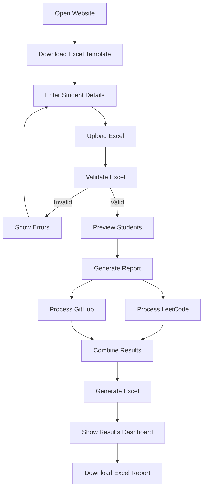
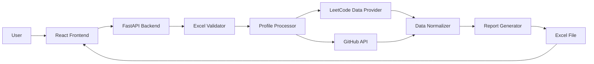

# 📊 Student Coding Analytics

<p align="center">
  
  
  
  
  
</p>

<p align="center">
  <b>Upload one Excel file → Analyze student coding profiles → Download a complete Excel report.</b>
</p>
<p align="center">
  <a href="#-overview">Overview</a> •
  <a href="#-features">Features</a> •
  <a href="#-workflow">Workflow</a> •
  <a href="#-architecture">Architecture</a> •
  <a href="#-installation">Installation</a> •
  <a href="#-usage">Usage</a>
</p>

---

## 🚀 Overview

**Student Coding Analytics** is a web-based analytics platform designed for colleges, faculty members, mentors, placement teams, and coding coordinators.

Instead of manually opening every student's LeetCode and GitHub profile, the application allows the user to upload a single Excel file containing student details.

The system validates the uploaded data, retrieves available public profile statistics, processes the results, and generates a professionally formatted Excel report.

### The idea in one line

> **Excel In → Coding Analytics → Excel Out**

---

## 🎯 Problem

Faculty and mentors often need to track the coding activity of many students.

Manually checking:

* LeetCode solved problems
* Easy / Medium / Hard distribution
* GitHub repositories
* Student profile URLs

can become repetitive and time-consuming when the number of students increases.

This project automates that workflow.

---

# ✨ Features

## 📁 Excel Upload

Upload a student Excel file containing:

| Column             | Description                    |
| ------------------ | ------------------------------ |
| `Reg.No`           | Student registration number    |
| `Name`             | Student name                   |
| `LeetCode Profile` | Student's LeetCode profile URL |
| `GitHub Profile`   | Student's GitHub profile URL   |

---

## 🧠 LeetCode Analytics

The system attempts to retrieve:

* Easy problems solved
* Medium problems solved
* Hard problems solved
* Total problems solved

The total is calculated/validated from the available source data.

---

## 🐙 GitHub Analytics

The system retrieves public GitHub information such as:

* Public repository count
* Profile validity
* Processing status

---

## 📊 Automatic Excel Report

The generated report contains:

| Reg.No   | Name      | Easy | Medium | Hard | Total Solved | GitHub Repositories | Status    |
| -------- | --------- | ---: | -----: | ---: | -----------: | ------------------: | --------- |
| 23ECE001 | Student 1 |  120 |     80 |   25 |          225 |                  18 | ✅ Success |
| 23ECE002 | Student 2 |   75 |     60 |   12 |          147 |                  11 | ✅ Success |

---

# 🎨 User Interface

The application is designed specifically for **first-time users**.

The user should never have to wonder:

> "What should I click next?"

The interface follows a simple guided workflow:

```text
┌─────────────────────────────────────┐
│      STUDENT CODING ANALYTICS       │
│                                     │
│  Analyze student coding activity    │
│                                     │
│       [ Upload Excel ]              │
│                                     │
│       [ Download Template ]         │
└─────────────────────────────────────┘

                 ↓

        ① Prepare Excel
                 ↓
        ② Upload Excel
                 ↓
        ③ Verify Students
                 ↓
        ④ Generate Report
                 ↓
        ⑤ Download Excel
```

---

# 🖥️ Interface Screens

## 🏠 Dashboard

The dashboard provides:

* Project introduction
* Upload button
* Excel template download
* Simple workflow explanation
* Help section

### Suggested screenshot

```text
docs/screenshots/dashboard.png
```

Add your actual screenshot here:

```markdown

```

---

## 📤 Excel Upload

The upload interface supports:

* Drag & drop
* Browse files
* `.xlsx`
* `.xls`

Example:

```text
╭──────────────────────────────────────╮
│                                      │
│               📄                     │
│                                      │
│       Drag & Drop Excel Here         │
│                                      │
│              OR                      │
│                                      │
│          [ Browse Files ]            │
│                                      │
│      Supported: .xlsx / .xls         │
│                                      │
╰──────────────────────────────────────╯
```

---

## 🔍 Excel Validation

Before processing, the application checks:

* Required columns
* Missing values
* Invalid URLs
* Duplicate registration numbers
* Duplicate profiles
* Unsupported file formats

Example:

```text
⚠ 3 Issues Found

Row 5
GitHub profile is missing.

Row 12
Invalid LeetCode profile.

Row 18
Duplicate Registration Number.

[ Fix Excel ]
```

---

# ⚙️ Processing Dashboard

The application provides real-time processing information.

Example:

```text
Generating Student Report

████████████████░░░░ 80%

40 / 50 students processed

✓ Excel validated
✓ GitHub data retrieved
✓ LeetCode data retrieved
⟳ Processing student 41...
```

The interface does not simply show a generic `Loading...` message.

---

# 📈 Results Dashboard

After processing, users can preview the report before downloading it.

### Summary Cards

```text
┌──────────────┐
│ 50           │
│ Students     │
└──────────────┘

┌──────────────┐
│ 47           │
│ Successful   │
└──────────────┘

┌──────────────┐
│ 2            │
│ Partial      │
└──────────────┘

┌──────────────┐
│ 1            │
│ Failed       │
└──────────────┘
```

---

# 🔎 Search & Filter

The results page supports:

### Search

Search by:

* Registration number
* Student name
* LeetCode username
* GitHub username

### Filters

```text
All
Success
Partial
Failed
```

### Sorting

Users can sort by:

* Registration number
* Name
* Easy
* Medium
* Hard
* Total solved
* Repository count

---

# 📥 Excel Export

Click:

```text
⬇ Download Excel Report
```

The application generates:

```text
student_coding_report_YYYY-MM-DD.xlsx
```

The workbook contains:

### Sheet 1 — Student Report

```text
Reg.No
Name
Easy
Medium
Hard
Total Solved
GitHub Repositories
Status
```

### Sheet 2 — Processing Summary

Contains:

* Total students
* Successful profiles
* Partial results
* Failed profiles
* Report generation time
* Data-source information

### Sheet 3 — Errors

Contains profiles for which data could not be retrieved.

---

# 🔄 Complete Workflow



---

# 🏗️ Architecture



---

# 🧩 Technology Stack

## Frontend

* React
* TypeScript
* Tailwind CSS
* Lucide Icons

## Backend

* Python
* FastAPI
* Pydantic

## Data Processing

* Pandas
* OpenPyXL

## External Data

* GitHub API
* LeetCode public data/access method where permitted

## Architecture

* REST API
* Background processing
* Validation layer
* Provider-based data retrieval

---

# 📂 Project Structure

```text
student-coding-analytics/
│
├── frontend/
│   ├── src/
│   │   ├── components/
│   │   ├── pages/
│   │   ├── services/
│   │   ├── hooks/
│   │   ├── types/
│   │   └── utils/
│   │
│   ├── package.json
│   └── ...
│
├── backend/
│   ├── app/
│   │   ├── api/
│   │   ├── services/
│   │   ├── models/
│   │   ├── schemas/
│   │   ├── utils/
│   │   └── main.py
│   │
│   ├── requirements.txt
│   └── ...
│
├── sample-data/
│   └── student_template.xlsx
│
├── docs/
│   └── screenshots/
│
├── .env.example
├── .gitignore
└── README.md
```

---

# 📋 Excel Input Format

The input Excel must contain:

```text
Reg.No | Name | LeetCode Profile | GitHub Profile
```

Example:

| Reg.No   | Name      | LeetCode Profile                   | GitHub Profile                |
| -------- | --------- | ---------------------------------- | ----------------------------- |
| 23ECE001 | Ashwath   | `https://leetcode.com/u/example/`  | `https://github.com/example`  |
| 23ECE002 | Student 2 | `https://leetcode.com/u/example2/` | `https://github.com/example2` |

### Important

The profile URLs must be correct and publicly accessible where applicable.

---

# 🛡️ Error Handling

One failed profile must **not stop the entire report**.

For example:

```text
Student 1 → ✅ Success
Student 2 → ✅ Success
Student 3 → ⚠ LeetCode unavailable
Student 4 → ⚠ GitHub profile not found
Student 5 → ✅ Success
```

The remaining students should continue processing.

---

# 🔐 Security

The application follows secure development practices including:

* File type validation
* File size restrictions
* URL validation
* Input sanitization
* API key protection
* Environment variables
* Rate limiting
* Request timeouts
* Secure temporary file handling
* CORS configuration
* No secrets in frontend code

Only permitted profile domains should be processed.

---

# 🔑 Environment Variables

Create:

```text
.env
```

Example:

```env
GITHUB_TOKEN=your_github_personal_access_token_here
BACKEND_URL=http://localhost:8000
```

### 🔒 GitHub Personal Access Token (PAT)

The backend requires a GitHub PAT to avoid rate-limit errors when processing large Excel files (unauthenticated limits are 60 requests/hr, while authenticated limits are 5,000 requests/hr).

**How to generate a token:**
1. Go to your GitHub account settings → **Developer settings** → **Personal access tokens** → **Fine-grained tokens**.
2. Click **Generate new token**.
3. Name it "Student Coding Analytics" and set expiration.
4. **Permissions:** Under "Repository permissions" and "Account permissions", you can leave everything as "No access". The application only reads public profile data.
5. Generate and copy the token.
6. Place it in the `.env` file as `GITHUB_TOKEN=`.

⚠️ **SECURITY WARNING:** NEVER commit your `.env` file to version control. Keep your token strictly on the backend server. Do not expose this token to the frontend or any client-side JavaScript.

Use:

```text
.env.example
```

instead for sharing the expected environment variables structure.

---

# ⚙️ Installation

## 1. Clone the repository

```bash
git clone https://github.com/YOUR_USERNAME/student-coding-analytics.git
```

```bash
cd student-coding-analytics
```

---

# 🖥️ Frontend Setup

```bash
cd frontend
```

Install dependencies:

```bash
npm install
```

Start development server:

```bash
npm run dev
```

---

# 🐍 Backend Setup

Open another terminal:

```bash
cd backend
```

Create virtual environment:

### Windows

```bash
python -m venv venv
venv\Scripts\activate
```

### Linux / macOS

```bash
python3 -m venv venv
source venv/bin/activate
```

Install dependencies:

```bash
pip install -r requirements.txt
```

Start FastAPI:

```bash
uvicorn app.main:app --reload
```

---

# 🌐 Local URLs

Frontend:

```text
http://localhost:5173
```

Backend:

```text
http://localhost:8000
```

FastAPI documentation:

```text
http://localhost:8000/docs
```

---

# 🔌 API Endpoints

| Method | Endpoint                 | Purpose                 |
| ------ | ------------------------ | ----------------------- |
| POST   | `/api/upload`            | Upload Excel            |
| POST   | `/api/analyze`           | Start analysis          |
| GET    | `/api/status/{job_id}`   | Processing status       |
| GET    | `/api/results/{job_id}`  | Retrieve results        |
| GET    | `/api/download/{job_id}` | Download Excel          |
| GET    | `/api/template`          | Download Excel template |

---

# 📊 Data Processing Flow

```text
Excel Upload
     ↓
Read Workbook
     ↓
Validate Columns
     ↓
Validate Student Data
     ↓
Validate Profile URLs
     ↓
Create Processing Job
     ↓
Retrieve Profile Data
     ↓
Normalize Data
     ↓
Calculate Totals
     ↓
Generate Excel
     ↓
Return Download
```

---

# 🧮 Total Problems Calculation

Where individual difficulty counts are available:

```text
Total Solved =
Easy + Medium + Hard
```

Example:

```text
Easy   = 100
Medium = 60
Hard   = 20

Total = 180
```

The application must never treat unavailable data as zero.

Use:

```text
N/A
```

when the value cannot be reliably obtained.

---

# 🔗 LinkedIn Integration

LinkedIn is intentionally treated differently from GitHub.

LinkedIn member data generally requires appropriate authentication and permissions.

Therefore the application should **not scrape arbitrary LinkedIn profiles**.

If LinkedIn integration is implemented later, it should use an authorized LinkedIn integration and only retrieve information permitted by LinkedIn's APIs and application permissions.

Possible future field:

```text
LinkedIn Posts
```

If the data cannot be legitimately retrieved:

```text
N/A
```

must be displayed rather than `0`.

---

# 🚦 Processing Status

Each student can have one of these statuses:

```text
✅ Success
⚠ Partial
❌ Failed
```

Examples:

```text
Success
```

All requested data was retrieved.

```text
Partial
```

Some data was unavailable.

```text
Failed
```

The profile could not be processed.

---

# 🧪 Testing

The project should include tests for:

### Excel

* Valid workbook
* Missing columns
* Invalid rows
* Duplicate registration numbers
* Invalid URLs

### GitHub

* Valid profile
* Invalid profile
* API error
* Rate limiting

### LeetCode

* Valid profile
* Invalid profile
* Unavailable data
* Network failure

### Reports

* Correct totals
* Missing values
* Partial results
* Multiple students

---

# 📱 Responsive Design

The interface is designed for:

* 🖥 Desktop
* 💻 Laptop
* 📱 Mobile
* 📲 Tablet

The primary report workflow is optimized for desktop because Excel/report generation is the main use case.

---

# ♿ Accessibility

The UI supports:

* Keyboard navigation
* Clear focus states
* Accessible labels
* Sufficient contrast
* Screen-reader-friendly controls
* Meaningful error messages

Status information must never depend solely on color.

---

# 🎯 Design Principles

The project follows five principles:

### 1. Simple

A first-time user should understand the application immediately.

### 2. Guided

Every page should tell the user what to do next.

### 3. Accurate

Never invent missing profile statistics.

### 4. Reliable

One failed profile should not stop the complete report.

### 5. Professional

The generated Excel should be suitable for college-level reporting.

---

# 🗺️ Roadmap

## Version 1.0

* [x] Excel upload
* [x] Excel validation
* [x] GitHub integration
* [x] LeetCode integration strategy
* [x] Student preview
* [x] Processing dashboard
* [x] Excel generation
* [x] Error handling
* [x] Responsive UI

## Version 2.0

* [ ] PostgreSQL database
* [ ] User accounts
* [ ] Saved reports
* [ ] Report history
* [ ] Admin dashboard
* [ ] Department management
* [ ] Export to CSV/PDF
* [ ] Advanced analytics

## Version 3.0

* [ ] Authorized LinkedIn integration
* [ ] Additional coding platforms
* [ ] Scheduled report generation
* [ ] Email reports
* [ ] College/department-level analytics

---

# 💡 Future Platform Integrations

The architecture can eventually support:

```text
┌───────────────┐
│   LeetCode    │
└───────┬───────┘
        │
┌───────▼───────┐
│    GitHub     │
└───────┬───────┘
        │
┌───────▼───────┐
│   LinkedIn*   │
└───────┬───────┘
        │
┌───────▼───────┐
│   CodeChef    │
└───────┬───────┘
        │
┌───────▼───────┐
│ HackerRank*   │
└───────────────┘
```

`*` Subject to platform API availability and authorization requirements.

---

# 🤝 Contributing

Contributions are welcome.

```bash
git checkout -b feature/new-feature
```

Make your changes and test them.

```bash
git add .
git commit -m "Add new feature"
git push origin feature/new-feature
```

Then open a Pull Request.

---

# 📜 License

Add the project's selected license here.

Example:

```text
MIT License
```

---

# 👨‍💻 Developer

**Ashwath P**

ECE Student | AI & IoT Developer

Interested in:

* Artificial Intelligence
* IoT
* Web Development
* Cloud Computing
* Automation
* Software Development

---

# ⭐ Support

If you find this project useful:

⭐ Star the repository
🍴 Fork the project
🐛 Report issues
💡 Suggest improvements
🤝 Contribute

---

<p align="center">

### Built to make student coding analytics simple.

**Excel → Analyze → Report**

</p>
